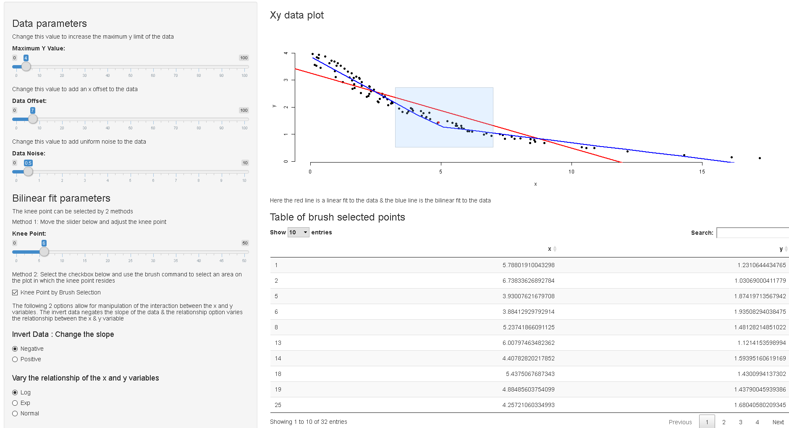

```{r,echo=FALSE}
library(plotly)
```
## Purpose

- The purpose of this assignment is to provide a pitch for the Shiny web application that has been developed.
- It will contain the methodology and the benifits of shiny and the application in question.


### Description

- There are instances where a bilinear model fit is a good starting point in data analysis. This however needs the selection of a knee point.
The aim of this application is to ease the selection of the knee point and get to it interactively.

- There are 3 main parts to the application:
    - The data generation (The user can vary parameters to get data of choice) & variable interaction
    - The knee point selection using the slider, here the user specifies the exact knee point to be used. 
    - The knee point selection using brush selection and a clustering algorithm

- A screen shot of the UI hosted on Shiny server is on the last page to familiarize the user with the interface.

## Data Generation

- Here we see the 3 possible relationships in the data the user can explore. The radio buttons in the application can toggle the different intervariable relationships. 
- There is also the functionality to invert the slopes, increase and decrease the noise in the data and the maximum limits of the plots.

```{r,warning=FALSE,message=FALSE,echo=FALSE}
  set.seed(100)
  offset <- 53
  param <- 44
  y <- runif(100,0,4)
  x <- -exp(y)+runif(100,-0.5,0.5)+offset
  x1 <- -log(y^5)+runif(100,-0.5,0.5)+offset
  x2 <- -y+runif(100,-0.5,0.5)+offset
  x3 <- exp(y)+runif(100,-0.5,0.5)+offset
  x4 <- log(y^5)+runif(100,-0.5,0.5)+offset
  x5 <- y+runif(100,-0.5,0.5)+offset
  test <- data.frame(x,y)

  par(mfrow=c(2,3))
  plot(x,y,main="Negative Exponential Relationship")
  plot(x1,y,xlab="x",main="Negative Log Relationship")
  plot(x2,y,xlab="x",main="Negative Linear Relationship")
  plot(x3,y,main="Positive Exponential Relationship")
  plot(x4,y,xlab="x",main="Positive Log Relationship")
  plot(x5,y,xlab="x",main="Positive Linear Relationship")
  
```

## Model Fitting

- We  fit two models for the data. A linear model in red & a bilinear model in blue.
- The knee point value has been parameterized (as a slider) for the user to hone in on the best knee value for the best fit. 

```{r,warning=FALSE,message=FALSE,echo=FALSE}
    # Testing out code for biliniar model fit with knot using random data log data
set.seed(100)
y <- runif(100,0,4)
x <- -log(y^5)+runif(100,-0.5,0.5)+7

xmin <- min(x)
xmax <- max(x)
test <- data.frame(x,y)
param <- 5

test$xprime <- ifelse(test$x-param>0,test$x-param,0)

model1 <- lm(y~x,data=test)
model2 <- lm(y~xprime+x,data=test)

{plot(test$x,test$y, xlab="x",ylab="y",bty="n",pch=16,main="Data with Linear and Bilinear Fits")
abline(model1,col="red",lwd=2)

model2lines <- predict(model2,newdata=data.frame(x=xmin:xmax,xprime=ifelse(xmin:xmax-param>0,xmin:xmax-param,0)))
lines(xmin:xmax,model2lines,col="blue",lwd=2)}
```

## Clustering using brushpoints

- Sometimes its easier visually to pickout the greatest mass in the data that might contain the knee point. 
- Inorder to do so, we use the brush points method (in shiny) to select the best section within which the knee point resides.
- A clustering algorithm is used to select the medoid of the data, this is used as the knee point in ensuing calculations. 
- This example shows the working of the clustering algorithm to select the mediod of the data in red.

```{r,warning=FALSE,message=FALSE,echo=FALSE}
df <- data.frame(X = rnorm(100, 0), Y = rnorm(100, 2))
plot(df$X, df$Y)
points(pam(df, 1)$medoids, col = "red",bty="n",pch=16)
```

## Putting it all together

Thank you.

```{r, fig.cap="Shiny Applcation UI", out.height ="50%",warning=FALSE,message=FALSE,echo=FALSE}

```

Thank you 
